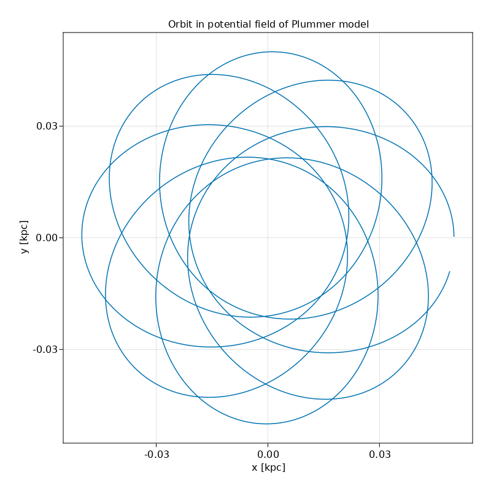

# 02 Autodiff on background potential field

```julia
using PhysicalParticles, UnitfulAstro
using AstroNbodySim
using CSV, DataFrames
using GLMakie

using Zygote

astro()
mkpathIfNotExist("output")

p1x(sim::Simulation) = find_particle(sim, 1).Pos.x
p1y(sim::Simulation) = find_particle(sim, 1).Pos.y

analysers = Dict(
    "x" => p1x,
    "y" => p1y,
)

G = Constant(uAstro).G

# Define the potential field of Plummer model
M = 1.0e6u"Msun"
b = 0.01u"kpc"

phi(p::PVector) = -(G*M)/sqrt(p*p+b*b)

# Autodiff by Zygote
acc(p::PVector) = -1.0*PVector(gradient(phi, p)[1]...)
acc(p::AbstractParticle) = acc(p.Pos)

bgforce = Function[acc]

R = 0.05u"kpc"
vel = sqrt(G*M/R)
T = 2*pi*sqrt(R^3 / G / M)
TimeEnd = 4.5*T

data = StructArray([Star(uAstro, id = 1)])
data.Pos[1] = PVector(            R, 0.0u"kpc", 0.0u"kpc")
data.Vel[1] = PVector(0.0u"kpc/Gyr",   0.7*vel, 0.0u"kpc/Gyr")


sim = Simulation(deepcopy(data);
    pids = [1],
    bgforce,
    analysers,
    TimeEnd,
    TimeBetweenSnapshots = TimeEnd,
    OutputDir = "AutodiffBackground"
)
run(sim)

# Plot
title = "Orbit in potential field of Plummer model"
df = DataFrame(CSV.File(joinpath(sim.config.output.dir, "analysis.csv")))
fig = Figure(resolution = (800,800))
axis = GLMakie.Axis(fig[1,1]; title, xlabel = "x [kpc]", ylabel = "y [kpc]")
axis.autolimitaspect = 1
Makie.lines!(axis, df.x, df.y)
Makie.save(joinpath("output/AutodiffBackground.png"), fig)
```


