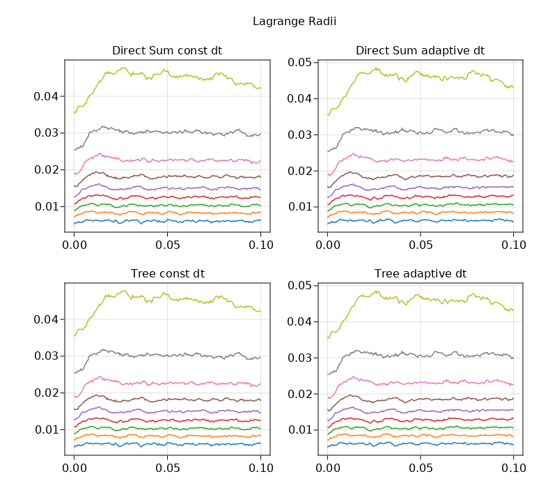

# 05 Plummer Star Cluster

In this example, we demonstrate how to:
- Simulate using DS gravity solver and Tree solver, both with adaptive and constant time-step
- Generate a Plummer star cluster using `AstroIC`
- Plot Lagrangian radii and scale radius

```julia
using AstroNbodySim, PhysicalParticles, Unitful, UnitfulAstro
astro()
mkpathIfNotExist("output")

# AstroIC supports initial condition sampling
using AstroIC
using PhysicalTrees

## First define a config. Keywords are necessary since the config type is immutable
config = PlummerStarCluster(
    collection = STAR,
    NumSamples = 1000,
    VirialRadius = 0.010u"kpc",
    TotalMass = 1.0e5u"Msun",
    model = AstroIC.Newton(),
)

## Now generate particles. MaxRadius restricts the sampling region.
particles = generate(config, MaxRadius = 0.1u"kpc");

TimeEnd = 0.1u"Gyr"
TimeStep = 0.000004u"Gyr"
TimeBetweenSnapshots = 0.0005u"Gyr"

@info "Testing multi-threading mode"
ds = Simulation(
    deepcopy(particles);
    TimeEnd,
    TimeBetweenSnapshots,
    TimeStep,
    OutputDir = "output/Plummer-DirectSum",
);

ds_adapt = Simulation(
    deepcopy(particles);
    TimeEnd,
    TimeBetweenSnapshots,
    TimeStep = 0.0u"Gyr",
    OutputDir = "output/Plummer-DirectSumAdaptive",
);

ts = Simulation(
    deepcopy(particles);
    TimeEnd,
    TimeBetweenSnapshots,
    TimeStep,
    GravitySolver = Tree(),
    OutputDir = "output/Plummer-Tree",
);

ts_adapt = Simulation(
    deepcopy(particles);
    TimeEnd,
    TimeBetweenSnapshots,
    TimeStep = 0.0u"Gyr",
    GravitySolver = Tree(),
    OutputDir = "output/Plummer-TreeAdaptive",
);

suggest_softlen!(ds)
suggest_softlen!(ds_adapt)
suggest_softlen!(ts)
suggest_softlen!(ts_adapt)

run(ds)
run(ds_adapt)
run(ts)
run(ts_adapt)

# Plots
using AstroIO

@info "Loading AstroPlot"
using AstroPlot
using AstroPlot.ColorSchemes
using Colors
using GLMakie
using Printf
using FFMPEG

function plotfigs(ds, ds_adapt, ts, ts_adapt)
    @info "Plotting radii"
    ScaleScene, ScaleLayout = layoutscene(resolution = (800, 800))
    LagrangeScene, LagrangeLayout = layoutscene(resolution = (800, 700))

    colors = ColorSchemes.tab10.colors

    AS1 = ScaleLayout[1,1] = GLMakie.Axis(ScaleScene, title = "Direct Sum const dt")
    AS2 = ScaleLayout[1,2] = GLMakie.Axis(ScaleScene, title = "Direct Sum adaptive dt")
    AS3 = ScaleLayout[2,1] = GLMakie.Axis(ScaleScene, title = "Tree const dt")
    AS4 = ScaleLayout[2,2] = GLMakie.Axis(ScaleScene, title = "Tree adaptive dt")

    AL1 = LagrangeLayout[1,1] = GLMakie.Axis(LagrangeScene, title = "Direct Sum const dt")
    AL2 = LagrangeLayout[1,2] = GLMakie.Axis(LagrangeScene, title = "Direct Sum adaptive dt")
    AL3 = LagrangeLayout[2,1] = GLMakie.Axis(LagrangeScene, title = "Tree const dt")
    AL4 = LagrangeLayout[2,2] = GLMakie.Axis(LagrangeScene, title = "Tree adaptive dt")

    plot_radii!(AS1, LagrangeScene, AL1, LagrangeLayout, ds.config.output.dir, "snapshot_", collect(0:200), ".gadget2", gadget2(); colors, times = collect(0.0:0.0005:0.1) * u"Gyr", legend=false)
    mv("radii.csv", "output/Plummer-DirectSum-radii.csv", force = true)

    plot_radii!(AS2, LagrangeScene, AL2, LagrangeLayout, ds_adapt.config.output.dir, "snapshot_", collect(0:200), ".gadget2", gadget2(); colors, times = collect(0.0:0.0005:0.1) * u"Gyr", legend=false)
    mv("radii.csv", "output/Plummer-DirectSumAdaptive-radii.csv", force = true)

    plot_radii!(AS3, LagrangeScene, AL3, LagrangeLayout, ts.config.output.dir, "snapshot_", collect(0:200), ".gadget2", gadget2(); colors, times = collect(0.0:0.0005:0.1) * u"Gyr", legend=false)
    mv("radii.csv", "output/Plummer-Tree-radii.csv", force = true)

    plot_radii!(AS4, LagrangeScene, AL4, LagrangeLayout, ts_adapt.config.output.dir, "snapshot_", collect(0:200), ".gadget2", gadget2(); colors, times = collect(0.0:0.0005:0.1) * u"Gyr", legend=false)
    mv("radii.csv", "output/Plummer-TreeAdaptive-radii.csv", force = true)

    colsize!(LagrangeLayout, 1, Relative(0.47))
    colsize!(LagrangeLayout, 2, Relative(0.47))
    rowsize!(LagrangeLayout, 1, Relative(0.5))
    rowsize!(LagrangeLayout, 2, Relative(0.5))

    supertitle = ScaleLayout[0,:] = Label(ScaleScene, "Scale Radius")
    Makie.save("output/Plummer-ScaleRadius.png", ScaleScene)

    supertitle = LagrangeLayout[0,:] = Label(LagrangeScene, "Lagrange Radii")
    Makie.save("output/Plummer-LagrangianRadii.png", LagrangeScene)
end

plotfigs(ds, ds_adapt, ts, ts_adapt)
```




