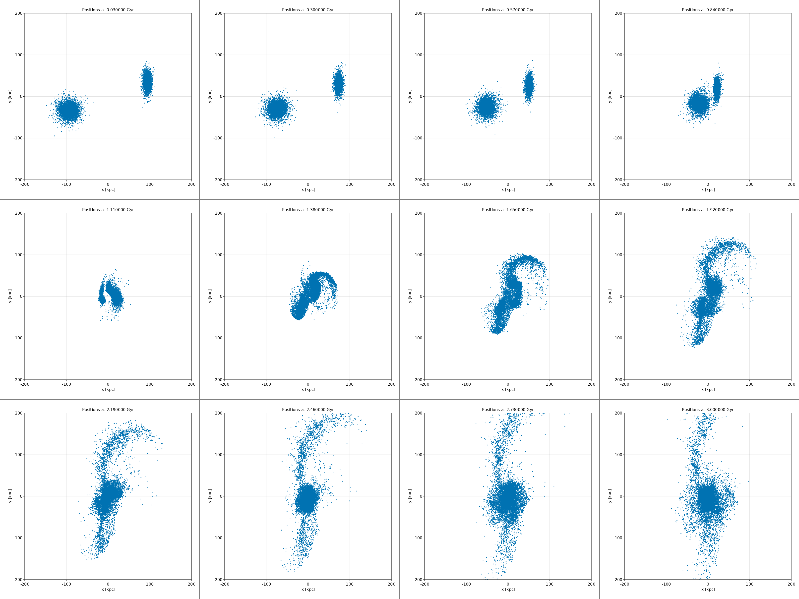

# 06 Galaxy Collision (GPU)

In this example, we demonstrate how to:
- Accelerate computation with GPU
- Compute with `Float32` (~10x faster on GPU than `Float64`)
- Load `Gadget-2` snapshot
- Plot position slices
- Mosaic view of position slices

```julia

using Unitful, UnitfulAstro
using Distributed
using PhysicalParticles
using AstroIC, AstroIO
using AstroNbodySim
using AstroPlot
using GLMakie
using Printf

mkpathIfNotExist("output")

# The file is in the folder of examples/04-collisions
header, d = read_gadget2(joinpath("galaxy_littleendian.dat"), uAstro, type=Star);  # 20000 disk and 40000 halo particles


TimeEnd = 3.0f0u"Gyr"
TimeBetweenSnapshots = 0.03f0u"Gyr"

gpu = Simulation(
    deepcopy(d);
    floattype = Float32,
    units = uAstro,
    TimeEnd,
    TimeBetweenSnapshots,
    OutputDir = "output/Collision-DirectSumAdaptiveGPU",
    constants = Constant(Float32, uAstro),
    ZeroValues = ZeroValue(Float32, uAstro),
    ForceSofteningTable = [0.4f0u"kpc" for i in 1:6],
    Realtime = false,
    device = GPU(),
);
run(gpu)


# Plot
plot_positionslice(gpu.config.output.dir, "snapshot_", collect(0:100), ".gadget2", gadget2(),
    dpi = 300, resolution = (600,600),
    xlims = (-200.0, +200.0), ylims = (-200.0, +200.0),
    times = collect(0.0:0.03:3.0) * u"Gyr",
    collection = DISK,
    markersize = 2.0,
)
plt = mosaicview(gpu.config.output.dir, "pos_", collect(1:9:100), ".png"; fillvalue = 0.5, npad = 3, ncol = 4, rowmajor = true);
save("output/mosaic-collision-DirectSumAdaptiveGPU.png", plt)
```

