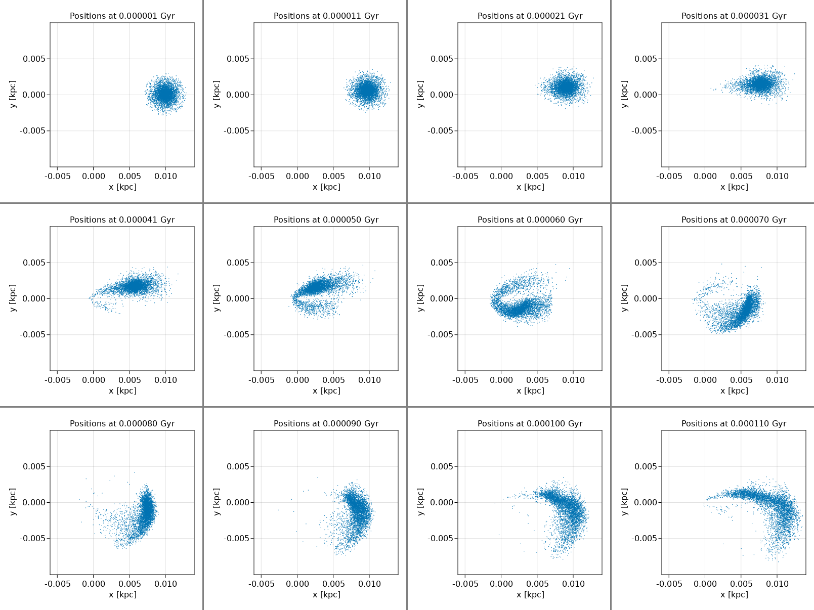
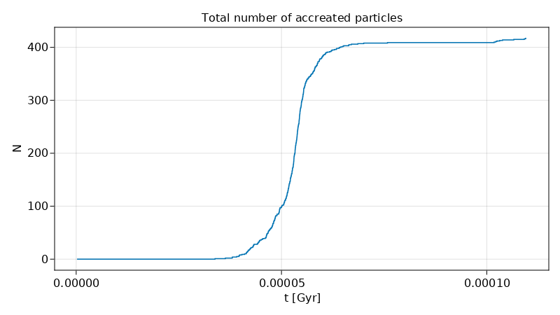

# 07 Tidal Disruption Event (TDE) of Star Cluster

In this example, we demonstrate how to:
- Define custom procedures to be executed in each time-step
- Remove accreted particles on the run
- Write and visualize accretion history
- Estimate properties of the black hole

```julia

using AstroNbodySim, PhysicalParticles
using Unitful, UnitfulAstro
using AstroIC
using AstroPlot
using DataFrames, CSV
using GLMakie
astro()
mkpathIfNotExist("output")

constant = Constant(uAstro)
G = constant.G
c = constant.c
MassBH = 1.0e8u"Msun"

M = 1.0e6u"Msun" # mass of Plummer star cluster
R = 0.01u"kpc"  # orbit radius at AP

Rg = r_g(G,MassBH,c)
@show "Schwarzchild radius: $(Rg)"


# Define the background force field of central black hole
#! For distributed computing, use @everywhere
function newtonAcc(p::AbstractParticle)
    return - G * MassBH / (p.Pos * p.Pos) * ustrip(u"kpc", normalize(p.Pos))
end
bgforce = Function[newtonAcc]


"""
    accretion(sim::Simulation)

If the particle runs too close to the BH, delete it and append to accretion list.
"""
function accretion(sim::Simulation) # Direct Sum multi-threading on CPU
    list = Int[]
    pos = sim.simdata.Pos
    for i in eachindex(pos)
        if norm(pos[i]) <= 10000*Rg
            push!(list, i)
        end
    end
    StructArrays.foreachfield(v->deleteat!(v,list), sim.simdata)
    return length(list)
end
analysers = Dict(
    "accretion" => accretion,
)


### TDE of star cluster with elliptic orbit

e = 0.94 # eccentricity

vel = sqrt((1.0-e)*G*MassBH/R)
@info "Velocity at ap: $(vel)"

a = ellipticSemiMajor(G, MassBH, R, vel)
@info "Length of semi-major axis: $(a)"

T = ellipticPeriod(G, MassBH, a)
@info "Period of elliptical orbit: $(T)"

pe = (1-e)/(1+e)*R
@info "pe orbit radius: $(pe)"


particles = generate(PlummerStarCluster(
        NumSamples = 400,
        VirialRadius = 0.001u"kpc",
        TotalMass = M,
    ),
    MaxRadius = 0.003u"kpc",
);

setpos(particles, PVector(R, 0.0u"kpc", 0.0u"kpc"))
setvel(particles, PVector(0.0u"kpc/Gyr", vel, 0.0u"kpc/Gyr"))


TimeEnd = T
TimeBetweenSnapshots = T / 100


elliptic = Simulation(
    deepcopy(particles);
    MinStep = 1.0e-11u"Gyr",
    TimeEnd,
    TimeBetweenSnapshots,
    bgforce,
    analysers,
    OutputDir = "output/TDE-elliptic",
    ForceSofteningTable = [0.05*suggest_softlen(particles) for i in 1:6],
)
run(elliptic)


### Plot
L = ustrip(R)
plot_positionslice(elliptic.config.output.dir, "snapshot_", collect(0:100), ".gadget2", gadget2(),
    dpi = 300, resolution = (600,600),
    xlims = (-0.6L, +1.4L), ylims = (-L, +L),
    times = collect(0:100) * TimeBetweenSnapshots,
    markersize = 0.0001,
)
plt = mosaicview(elliptic.config.output.dir, "pos_", collect(1:9:100), ".png"; fillvalue = 0.5, npad = 3, ncol = 4, rowmajor = true);
save("output/TDE-elliptic-mosaic.png", plt)

# Accretion history
df = DataFrame(CSV.File(joinpath(elliptic.config.output.dir, "analysis.csv")))
N = similar(df.accretion)
N[1] = df.accretion[1]
s = N[1]
for i in 2:length(N)
    @inbounds s += df.accretion[i]
    @inbounds N[i] = s
end
@info "Total particles accreated: $(N[end])"

fig = Figure(; resolution = (800, 450))
axis = GLMakie.Axis(fig[1,1],
    title = "Total number of accreated particles",
    xlabel = "t [Gyr]",
    ylabel = "N",
)
GLMakie.lines!(axis, df.time, N)
Makie.save("output/TDE-elliptic-AccretionHistory.png", fig)
```




