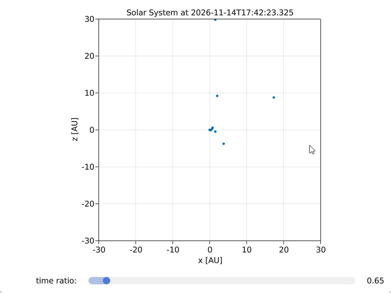

# 08 Solar System

```julia
using GLMakie
using AstroPlot
using PhysicalParticles, Unitful, UnitfulAstro
using AstroLib
using Dates
using ProgressMeter

using AstroIC

function display_solarsystem(startdate = now(); fps = 60.0, N = 10000, ratio = 1.0, adapt = true)
    last_plot_time = time()
    time_between_plot = 1.0 / fps # ms

    T = jdcnv(startdate)

    fig = GLMakie.Figure()
    
    title = Observable("Solar System at " * string(startdate))
    ax = GLMakie.Axis(
        f[1,1],
        title = title,
        xlabel = "x [AU]",
        ylabel = "z [AU]",
        aspect = AxisAspect(1.0),
    )

    ls = labelslider!(f, "time ratio: ",  0.1:0.01:10.0)
    ls.slider.value = ratio
    f[2,1] = ls.layout

    xu, yu = pack_xy(solarsystem(T), yaxis = :z)
    x = ustrip.(u"AU", xu)
    y = ustrip.(u"AU", yu)
    if adapt
        GLMakie.xlims!(ax, (middle(x) - 22, middle(x) + 22))
        GLMakie.ylims!(ax, (middle(y) - 22, middle(y) + 22))
    else
        GLMakie.xlims!(ax, (-30, +30))
        GLMakie.ylims!(ax, (-30, +30))
    end

    pos = Observable([x y])
    GLMakie.scatter!(ax, pos, markersize = 5.0)
    display(f)

    @showprogress for i in 1:N
        if time() - last_plot_time > time_between_plot
            #T += to_value(sl1.value)
            T += to_value(ls.slider.value)
            
            xu, yu = pack_xy(solarsystem(T), yaxis = :z)
            x = ustrip.(u"AU", xu)
            y = ustrip.(u"AU", yu)        
            if adapt
                GLMakie.xlims!(ax, (middle(x) - 22, middle(x) + 22))
                GLMakie.ylims!(ax, (middle(y) - 22, middle(y) + 22))
            end
            @async title[] = "Solar System at " * string(daycnv(T))
            @async pos[] = [x y]
            last_plot_time = time()
        end
        sleep(0.1 / fps)
    end
    return fig
end

display_solarsystem(adapt = false)
```


